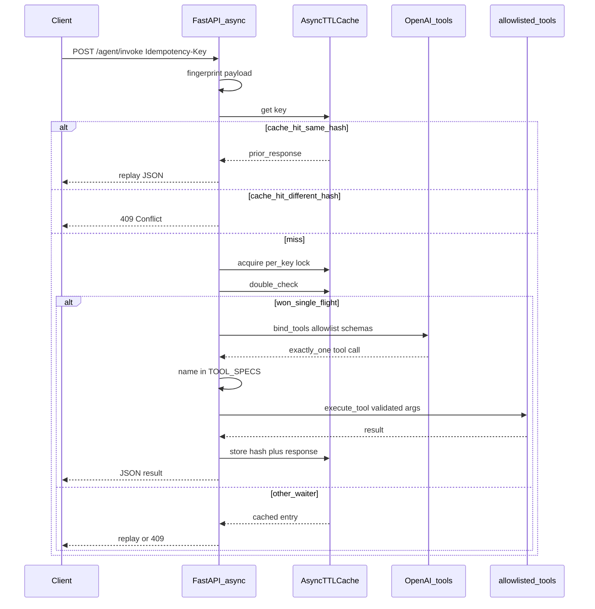

# Sequence diagram (Part B)

Hardened agent invoke path with fingerprint-bound, per-key single-flight idempotency and allowlisted tools.

```text
Idempotency-Key
     ↓
request fingerprint (canonical JSON hash)
     ↓
per-key single-flight lock
     ↓
double-check cache
     ↓
execute once
     ↓
cache {request_hash, response}
```



Offline / tests may skip the LLM by sending `force_tool` + `force_args`; allowlist validation still applies.
