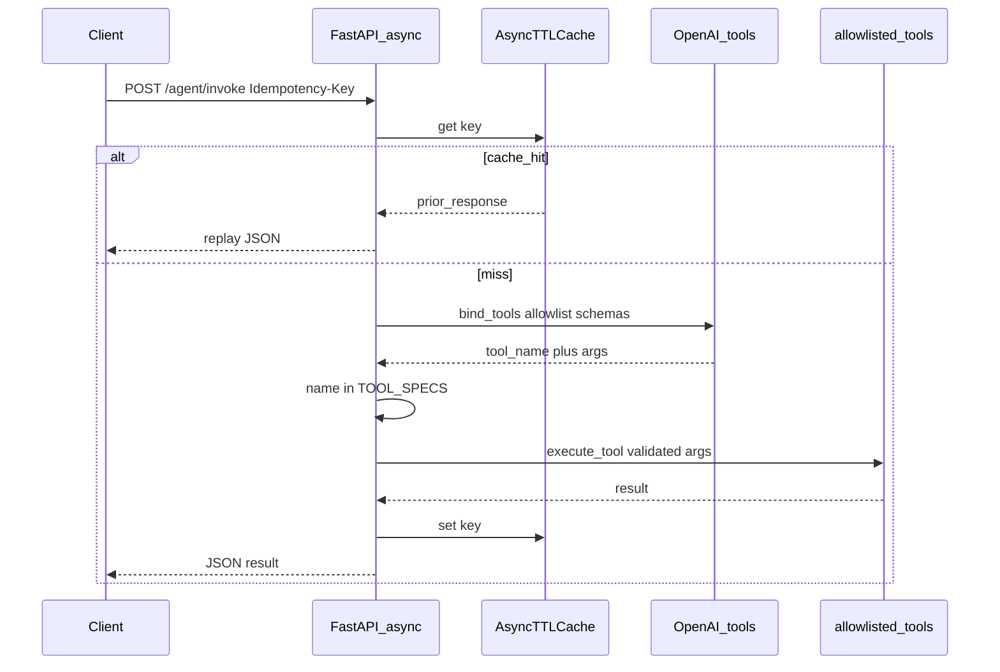

# Sequence diagram (Part B)

Hardened agent invoke path with idempotency and allowlisted tools.

Offline / tests may skip the LLM by sending `force_tool` + `force_args`; allowlist validation still applies.
