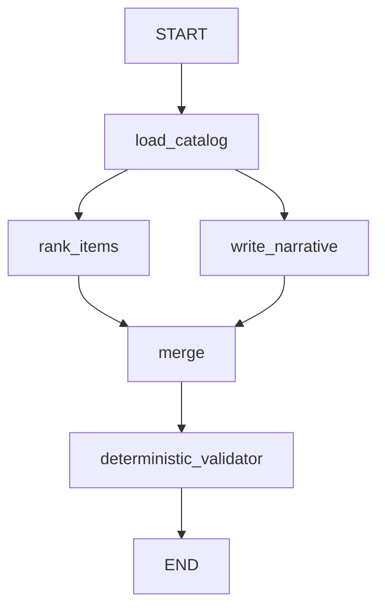

# Workflow diagram (Part A)

LangGraph recommendation pipeline: catalog load, parallel rank + narrative, merge, deterministic validation.

## Notes

- If the catalog is empty or malformed, `catalog_ok=false` and both branches record errors; the validator **fails closed**.
- `write_narrative` recomputes the same deterministic ranking locally when running in parallel with `rank_items`, so it never invents titles outside what ranking would produce.
- The validator is pure Python (no LLM).
